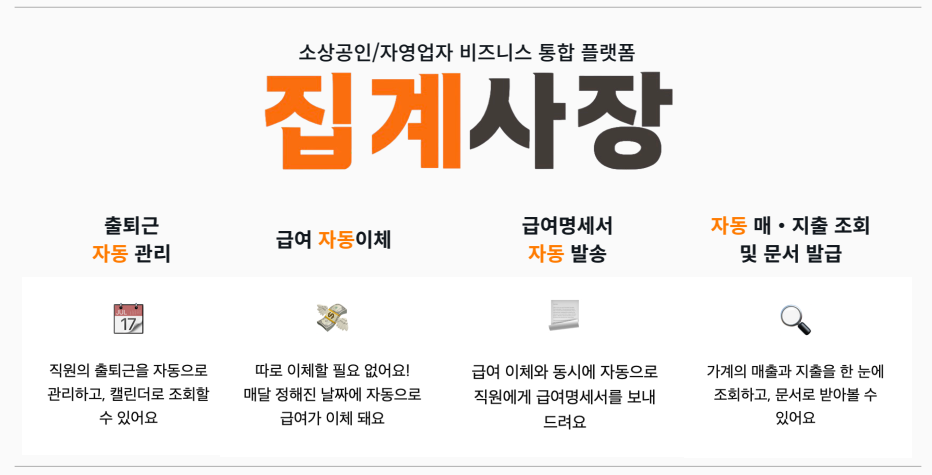
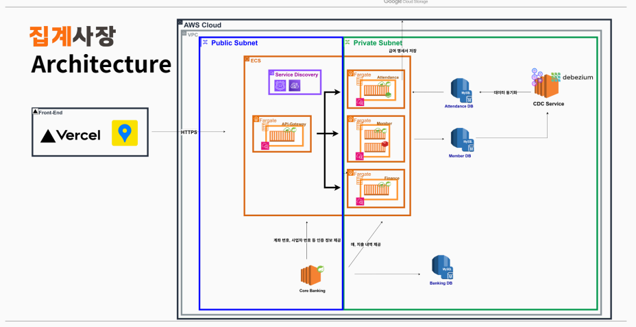
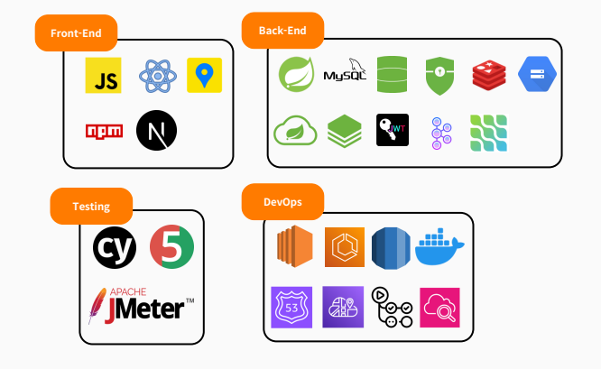

# 집계사장
소상공인/자영업자 통합 비즈니스 관리 플랫폼 및 BaaS 기반 임베디드 금융 서비스
 

## 🦀 프로젝트 소개
집계사장은 소상공인/자영업자의 직원 출퇴근 관리와 재무 관리를 돕는 클라우드 네이티브 애플리케이션입니다. 

## 🍔 프로젝트 배경
소상공인/자영업자는
- 직원 출퇴근 관리
- 직원 급여 관리 및 급여 명세서 발송
- 매/지출 관리 및 문서 작성

등의 업무에서 불편함을 겪고 있습니다. 
집계사장은 이러한 소상공인/자영업자 분들의 불편함을 해결하며, 상생금융의 가치를 실현하고자 개발된 BaaS 기반 임베디드 금융 서비스입니다.

## 🏦 BaaS(Banking as a Service) 기반 서비스
집계사장은 금융 API를 활용한 BaaS 모델을 적용한 서비스입니다. 

- **금융 서비스 임베딩**: 금융기관의 API를 통해 계좌 조회, 급여 이체 등의 금융 기능을 제공
- **원스톱 비즈니스 관리**: 별도의 뱅킹 앱 없이 집계사장 내에서 모든 업무 처리 가능

## 💫 특징 및 장점
집계사장의 핵심 가치는 '자동화'와 '편의성'입니다. 디지털 기기 사용에 익숙하지 않은 소상공인/자영업자 분들도 쉽게 사용할 수 있도록 직관적인 UI/UX를 제공합니다.

- **원터치 자동화 시스템**: 초기 기본 정보(사업장 등록, 직원 정보)만 입력하면 모든 관리 기능이 자동으로 작동
- **최소한의 사용자 개입**: 타서비스와 달리 직원의 출퇴근을 관리하기 위해 직원은 서비스에 가입할 필요 없음
- **직관적인 인터페이스**: 앱 사용이 익숙하지 않은 사용자도 쉽게 이용 가능한 단순하고 명확한 디자인

- 
## 🛠️ 제공 서비스

- **출퇴근 자동관리**: QR코드 인식만으로 직원 출퇴근 시간 자동 기록
- **급여 자동이체**: 설정된 일정에 맞춰 급여 자동 계산 및 송금
- **급여명세서 자동 발송**: 급여 지급과 동시에 직원들에게 명세서 자동 전송
- **자동 매/지출 조회**: 계좌 연동으로 매출과 지출 내역 자동 집계 
- **비즈니스 문서 자동 발급**: 세금계산서, 영수증 등 필요 문서 자동 생성

## 💼 비즈니스 가치
집계사장은 소상공인/자영업자의 재무 업무 부담을 최소화하고, 본업에 집중할 수 있는 환경을 제공합니다. 비싸거나 복잡한 타서비스와 달리 누구나 쉽게 사용할 수 있는 솔루션으로, 소상공인의 쉬운 비즈니스를 지원합니다.

## 시스템 아키텍처
집계사장은 클라우드 네이티브 환경에 최적화된 MSA(Microservice Architecture) 구조로 설계되었습니다. 

## 🔧 기술 스택

## 🎬 시연 영상
시연 영상을 통해 유저 플로우를 확인해보세요. 링크를 누르시면 유튜브로 연결됩니다.

## 🌟 주요 기능
은행사 API를 바탕으로 코어 뱅킹을 자체적으로 구축하여, 이를 활용했습니다.

### 사업장 등록
- 우리 은행을 사업자 계좌로 사용하는 사업장만 등록이 가능합니다.
- 사업자 정보 검증, 계좌 정보 검증, 이메일을 통한 본인 인증, PIN 번호 활용 인증의 4단계 인증 후 사업장 등록이 가능합니다.
- 카카오맵 API를 활용하여 가게의 현재 위치를 입력 받게 됩니다.(위도, 경도)

### 매·지출 내역 조회
- 자체 구축한 코어 뱅킹을 통해 해당 사업장의 매·지출 내역 차트를 확인할 수 있습니다.

### 원클릭 급여 명세서, 간펴 장부 발급
- 한 번의 클릭만으로 가게의 해당 월 손익 계산서, 간편 장부를 발급받을 수 있습니다.

### 직원 출·퇴근 관리
- 카카오맵 API와 QR 코드를 활용하여 별도의 출·퇴근용 기기 설치 없이 폰으로 출·퇴근 기록이 가능합니다.
- 가게별 직원을 등록하면 해당 직원에게 QR 코드가 발급되고 직원은 QR 코드를 통해 출·퇴근 시간을 기록합니다.
- 사업장의 사장님은 직원의 출·퇴근 내역을 조회/수정/삭제할 수 있습니다. 

### 급여 계산 · 자동 이체
- 직원의 출·퇴근 기록을 바탕으로 직원의 급여를 자동으로 계산합니다.
- Spring Batch를 활용하여 직원에게 급여를 자동 이체합니다.
- 자동 이체 진행 시, 이에 대한 급여 명세서가 직원의 이메일로 자동으로 발송됩니다.

## 📱 사용자 인터페이스 설계서
📄[user_interface.pdf](/public/docs/user_interface.pdf) 

## 👨‍💻 팀원 소개

| | | |
|:---:|:---:|:---:|
|  |  | |
| [임지혁](https://github.com/username) | [류태리](https://github.com/hyeri1126) | [강세현](https://github.com/ksp0814) |
| 팀장 | Frontend 팀장 | PM Frontend 팀원 Backend 팀원 |
| • MSA 통합통 구축 • 클로딩 간편장부, 급여왓세서 발급 구현 • ECS 통용 컨테이너 오케스트레이션 • CDC 구축 • 급여 자동 이체 프로세스 구현 | • Frontend 검포넌트 구조 설계 • JWT 활용 인증/인가(FrontEnd) • UI/UX 총괄 • 농협 핵심 컨트롤러 페이지 구현 | • 프로젝트 기획 • CORE BANKING 구축 • 외부 API 통신 |

| | | |
|:---:|:---:|:---:|
|   |   |  |
| [이현아](https://github.com/username) | [박준형](https://github.com/my123dsa) | [정성윤](https://github.com/apple6346654) |
| PM Frontend 팀원 Backend 팀원 | Backend 팀장 | Frontend 팀원 Backend 팀원 |
| • 서비스 기획 • 매/지출 그래프 시각화 • 급여 자동 이체 • 사용자 인증 트랙 | • 사용자 인증/인가 • 급여 자동 이체 총괄 • 자동 급여명세서 발급 • BE CI/CD 파이프라인 구축 | • Core Bank 데이터센 구성 및 서버 구축 • 사용자 인증 • 사용자 정보 CRUD • Cypress 테스트 총괄 |

