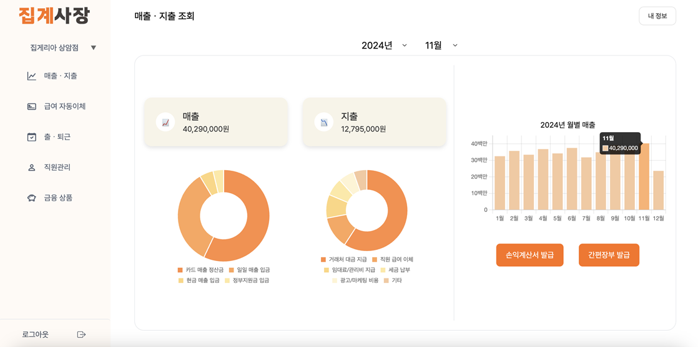

# 집계사장
소상공인/자영업자 통합 비즈니스 관리 플랫폼 및 BaaS 기반 임베디드 금융 서비스
  

## 🦀 프로젝트 소개
집계사장은 소상공인/자영업자의 직원 출퇴근 관리와 재무 관리를 돕는 클라우드 네이티브 애플리케이션입니다. 
  

## 🍔 프로젝트 배경
소상공인/자영업자는
- 직원 출퇴근 관리
- 직원 급여 관리 및 급여 명세서 발송
- 매/지출 관리 및 문서 작성

등의 업무에서 불편함을 겪고 있습니다. 
집계사장은 이러한 소상공인/자영업자 분들의 불편함을 해결하며, 상생금융의 가치를 실현하고자 개발된 BaaS 기반 임베디드 금융 서비스입니다.
  
## 🏦 BaaS(Banking as a Service) 기반 서비스
집계사장은 금융 API를 활용한 BaaS 모델을 적용한 서비스입니다. 

  
## 💫 특징 및 장점
집계사장의 핵심 가치는 '자동화'와 '편의성'입니다. 디지털 기기 사용에 익숙하지 않은 소상공인/자영업자 분들이 쉽게 사용할 수 있도록 직관적인 UI/UX를 제공합니다.

- **원터치 자동화 시스템**: 초기 기본 정보(사업장 등록, 직원 정보)만 입력하면 모든 관리 기능이 자동으로 작동
- **최소한의 사용자 개입**: 타서비스와 달리 직원의 출퇴근을 관리하기 위해 직원은 서비스에 가입할 필요 없음
- **직관적인 인터페이스**: 앱 사용이 익숙하지 않은 사용자도 쉽게 이용 가능한 단순하고 명확한 디자인

 

## 🛠️ 제공 서비스

- **출퇴근 자동관리**: QR코드 인식만으로 직원 출퇴근 시간 자동 기록
- **급여 자동이체**: 설정된 일정에 맞춰 급여 자동 계산 및 송금
- **급여명세서 자동 발송**: 급여 지급과 동시에 직원들에게 급여명세서 자동 발송
- **자동 매/지출 조회**: 계좌 연동으로 매출과 지출 내역 카테고리별로 시각화
- **비즈니스 문서 자동 발급**: 급여명세서, 간편장부 등 필요 문서 자동 생성

 

## 💼 비즈니스 가치
집계사장은 소상공인/자영업자의 재무 업무 부담을 최소화하고, 본업에 집중할 수 있는 환경을 제공합니다. 비싸거나 복잡한 타서비스와 달리 누구나 쉽게 사용할 수 있는 솔루션으로, 소상공인의 쉬운 비즈니스를 지원합니다.

 

## 시스템 아키텍처
집계사장은 클라우드 네이티브 환경에 최적화된 MSA(Microservice Architecture) 구조로 설계되었습니다. 

 

## 🔧 기술 스택

 

## 🎬 시연 영상
시연 영상을 통해 유저 플로우를 확인해보세요. 링크를 누르시면 유튜브로 연결됩니다.

 

## 🌟 주요 기능
은행사 API를 바탕으로 코어 뱅킹을 자체적으로 구축하여, 이를 활용했습니다.

### 사업장 등록
- 우리 은행을 사업자 계좌로 사용하는 사업장만 등록이 가능합니다.
- 사업자 정보 검증, 계좌 정보 검증, 이메일을 통한 본인 인증, PIN 번호 활용 인증의 4단계 인증 후 사업장 등록이 가능합니다.
- 카카오맵 API를 활용하여 가게의 현재 위치를 입력 받게 됩니다.(위도, 경도)

### 매·지출 내역 조회
- 자체 구축한 코어 뱅킹을 통해 해당 사업장의 매·지출 내역 차트를 확인할 수 있습니다.

### 원클릭 급여 명세서, 간편 장부 발급
- 한 번의 클릭만으로 가게의 해당 월 손익 계산서, 간편 장부를 발급받을 수 있습니다.

### 직원 출·퇴근 관리
- 카카오맵 API와 QR 코드를 활용하여 별도의 출·퇴근용 기기 설치 없이 폰으로 출·퇴근 기록이 가능합니다.
- 가게별 직원을 등록하면 해당 직원에게 QR 코드가 발급되고 직원은 QR 코드를 통해 출·퇴근 시간을 기록합니다.
- 사업장의 사장님은 직원의 출·퇴근 내역을 조회/수정/삭제할 수 있습니다. 

### 급여 계산 · 자동 이체
- 직원의 출·퇴근 기록을 바탕으로 직원의 급여를 자동으로 계산합니다.
- Spring Batch를 활용하여 직원에게 급여를 자동 이체합니다.
- 자동 이체 진행 시, 이에 대한 급여 명세서가 직원의 이메일로 자동으로 발송됩니다.

 

## 📱 사용자 인터페이스 설계서
📄[user_interface.pdf](public/docs/user_interface.pdf) 

 

## 👨‍💻 팀원 소개

| | | |
|:---:|:---:|:---:|
|  |  | |
| [임지혁](https://github.com/jihyuk0414) | [류혜리](https://github.com/hyeri1126) | [강세필](https://github.com/ksp0814) |
| 팀장 | Frontend 팀장 | PM Frontend 팀원 Backend 팀원 |
| • MSA 통합통 구축 • 클로딩 간편장부, 급여왓세서 발급 구현 • ECS 통용 컨테이너 오케스트레이션 • CDC 구축 • 급여 자동 이체 프로세스 구현 | • Frontend 검포넌트 구조 설계 • JWT 활용 인증/인가(FrontEnd)  사업장 등록 4단계 인증 프로세스 구현(Context API 활용)    • 복잡한 인증 데이터 상태 관리 및 API 통신 최적화 | • 프로젝트 기획 • CORE BANKING 구축 • 외부 API 통신 |

| | | |
|:---:|:---:|:---:|
|   |   |  |
| [이현아](https://github.com/gusdk19) | [박준혁](https://github.com/my123dsa) | [정성윤](https://github.com/apple6346654) |
| PM Frontend 팀원 Backend 팀원 | Backend 팀장 | Frontend 팀원 Backend 팀원 |
| • 서비스 기획 • 매/지출 그래프 시각화 • 급여 자동 이체 • 전반적인 UI/UX 설계 및 디자인 | • 사용자 인증/인가 • 급여 자동 이체 총괄 • 자동 급여명세서 발급 • BE CI/CD 파이프라인 구축 | • Core Bank 데이터센 구성 및 서버 구축 • 사용자 인증 • 사용자 정보 CRUD • Cypress 테스트 총괄 |

 

## 👥 개인별 회고
### 임지혁
- 사회에 기여함과 동시에 금융과 관련된 프로젝트를 진행할 뿐 아니라, 이를 클라우드 네이티브 애플리케이션으로 개발하자는 욕심 많은 프로젝트였다고 생각한다. 이렇게 많은 목표를 모두 달성하고자 하다보니 마음이 급해 최초 컨벤션을 상세히 정하지 못했고, 부족한 고려로 인해 프로젝트 중반 ERD를 수정했어야 했던 점들은 아쉬움이 남는다. 하지만 하나의 기술을 사용하더라도 해당 기술을 사용해야 하는 이유를 꼭 제시하였기 때문에, 프로젝트 진행 과정에서 초기 기획의도를 잃지 않고 일관된 방향성을 유지할 수 있었다고 생각한다. 특히 디지털 취약계층을 고려하여 '원 클릭','자동화'를 항상 고려하며 개발을 진행했으며, 그 과정에서 개발자는 제한된 자원 속에서 프로세스의 간소화, 안정성, 성능 모두에 대해 고려해야 함을 깨달을 수 있었다. 이번 최우수 프로젝트 수상은 MSA, Spring Batch 등 낯설고 복잡한 지식들에 대해서 적극적으로 학습하고 의견을 제시해준 팀원들이 만든 성과라고 생각한다. 욕심도 많고 부족한 팀장이었는데, 언제나 믿어주고 최선을 다해 프로젝트에 임해준 팀원들에게 진심으로 감사함을 전하고 싶다.
### 류혜리
- 처음으로 프론트엔드 리드를 맡아 큰 책임감을 느꼈다. 팀원들이 일관된 환경에서 개발할 수 있는 기반을 구축하는 데 집중했고, 그 과정에서 많이 성장할 수 있었다. 특히 일관적이지 않았던 API 응답 형식으로 인해 각 프론트엔드 개발자들이 예외 처리와 응답 처리를 제각각 다르게 구현하면서 코드의 일관성과 유지보수성이 떨어지는 문제가 있었다. 이 문제를 인지했을 때는 이미 프로젝트 중반이었고, 기능 구현에 급급했던 상황이라 팀원들은 리팩토링 보다는 기능 개발에 집중하자는 의견이었다. 하지만 추후 더 큰 문제를 방지하고 코드 품질을 향상시키고자 팀원들을 설득했다. 팀원들은 의견을 수용해주었고, 백엔드 팀도 하던 기능 구현을 잠시 멈추고 응답 형식 표준화를 진행해주었다. 프론트엔드에서도 통일된 응답/에러 처리 방식을 적용하면서 결과적으로 개발 속도가 크게 향상되었고, 더 안정적인 애플리케이션을 만들 수 있었다. 이 경험을 통해 프로젝트 초기에 백엔드와 프론트엔드 간의 명확한 응답 형식 컨벤션을 정의하는 것이 얼마나 중요한지 깨달을 수 있었다. 뿐만 아니라 생소했던 주제인 BaaS와 MSA 구조도 팀원들과의 깊은 고민과 적극적인 기술 아티클 공유로 깊이 이해할 수 있었다.  이 프로젝트는 최우수상 프로젝트 성과 뿐 아니라 좋은 개발 동료를 만날 수 있게 해준 좋은 경험이자 추억이다. 
### 강세필
- 이번 프로젝트는 기획부터 개발까지 전 과정을 팀원들과 함께하며 진행했습니다. 정해진 기간 안에 결과물을 완성할 수 있을지에 대한 걱정도 많았지만, 팀원들이 각자의 역할에 책임감을 갖고 충실히 임해준 덕분에 프로젝트를 성공적으로 마무리할 수 있었습니다. 이 과정을 통해 팀원 간의 소통이 얼마나 중요한지 다시 한번 느꼈고, 문제를 해결하기 위해 학습하고 고민하는 과정에서 많은 성장을 경험할 수 있었습니다. 특히, 서로의 코드를 리뷰하며 생각과 스킬을 공유했던 시간들이 기억에 남습니다. 이러한 팀 문화 덕분에 프로젝트가 더 원활히 진행될 수 있었던 것 같습니다. 좋은 팀원들과 함께할 수 있었던 점에 감사하며, 이번 경험을 계기로 부족한 부분들을 채워 나가며 한 걸음씩 성장하는 개발자가 되기 위해 계속 노력하겠습니다.
### 이현아
- 생소한 주제라 걱정이 많았는데, 어떻게 하면 소상공인/자영업자가 보다 편리하게 우리 서비스를 사용할 수 있을까 팀원들과 함께 고민하면서 많이 성장할 수 있었다. 주제에 망설임도 많았고, 프로젝트 도중 문제를 알게 돼 ERD와 로직을 바꾸기도 하고, 익숙하지 않은 MSA에 어려움도 있었지만 팀원들 덕분에 프로젝트를 잘 마무리하고 최우수 프로젝트상까지 받을 수 있었다. 컨벤션을 더욱 세부적으로 정하고 코드를 작성했다면 보다 통일감 있지 않았을까 아쉬움이 남고, 앞으로 리팩토링 과정을 통해 좋은 코드를 고민하는 시간이 필요할 것 같다. 프로젝트를 진행하며 보안이나 인프라를 포함하여 스스로의 지식이 부족함을 느꼈고, 이러한 점을 보다 깊이 있게 공부하고 부족함을 채울 예정이다. 짧은 기간이었지만 각 팀원들로부터 지식, 겸손함, 배려를 비롯한 많은 것들을 배울 수 있었고, 팀원들이 모두 마음을 합치면 좋은 결과물과 성과를 낼 수 있음을 깨달았다. 많은 것을 배우고 좋은 사람들과 함께해 감사한 마음 뿐인 프로젝트였다.
### 박준현
- 이번 프로젝트는 제가 처음으로 백엔드 책임자로 참여한 경험으로, 긴장감과 책임감이 컸던 도전이었습니다. 매 순간 최선을 다해 문제를 해결과 팀의 목표를 달성하기 위해 지속적으로 노력했고 일일 회의를 통해 진행 상황을 관리하며 원활한 소통으로 효율적인 협업을 할 수 있었습니다. 팀원들 모두 자신의 역할을 충실히 수행하며 높은 책임감을 보여주었고, 프로젝트 중반의 큰 전환점을 맞이했을 때도 협력하여 문제를 해결하며 협업의 중요성을 깊이 깨달았습니다. 다만 초기부터 GitHub 워크플로우를 도입했다면 문서화와 기록 관리가 더 효율적이었을 것입니다. 또한, 코드, 커밋, PR, 브랜치에 대한 명확한 컨벤션을 설정했다면 코드 리뷰와 작업 추적이 더욱 수월했을 것이라는 아쉬움도 남습니다. 7주라는 짧은 시간이었지만 운이 좋게도 좋은 팀원들을 만나 정말 많은 것을 배우고 개발자의 마인드를 다시 생각해보는 계기가 되었던 것 같습니다.
### 정성윤
- 이번 프로젝트에서는 FE와 BE를 함께 개발하며 처음으로 MSA를 경험했다. 이전까지는 단일 애플리케이션 개발 방식에 익숙했기에, 서비스 간 연동과 구조를 이해하는 데 어려움이 있었다. 하지만 팀원들의 차근차근한 설명 덕분에 생각보다 빠르게 적응할 수 있었다. 개발 속도가 기대만큼 나오지 않아 프로젝트가 뒤처질까 불안했던 순간도 있었다. 이를 극복하기 위해 새벽까지 학습하며 부족한 부분을 채우려 노력했고, 그 과정에서 큰 성취감과 함께 스스로 성장할 수 있었다.
가끔 의사소통이 원활하지 않아 잘못된 코드를 작성했던 아쉬운 점도 있었다. 하지만 이를 통해 상대방과의 소통과 공유의 중요성을 깨닫고, 협업에 더 신경 쓰게 되는 계기가 되었다. 이번 프로젝트를 통해 기술적인 성장뿐만 아니라 협업의 중요성과 배려하는 자세를 배울 수 있었다. 어려운 순간에도 함께 해결 방안을 모색하며 끝까지 완주할 수 있었던 경험은 앞으로도 소중한 기억으로 남을 것이다. 부족한 나를 끝까지 믿고, 최우수 프로젝트로 이끌어 준 팀원들에게 진심으로 깊은 감사를 전한다.
